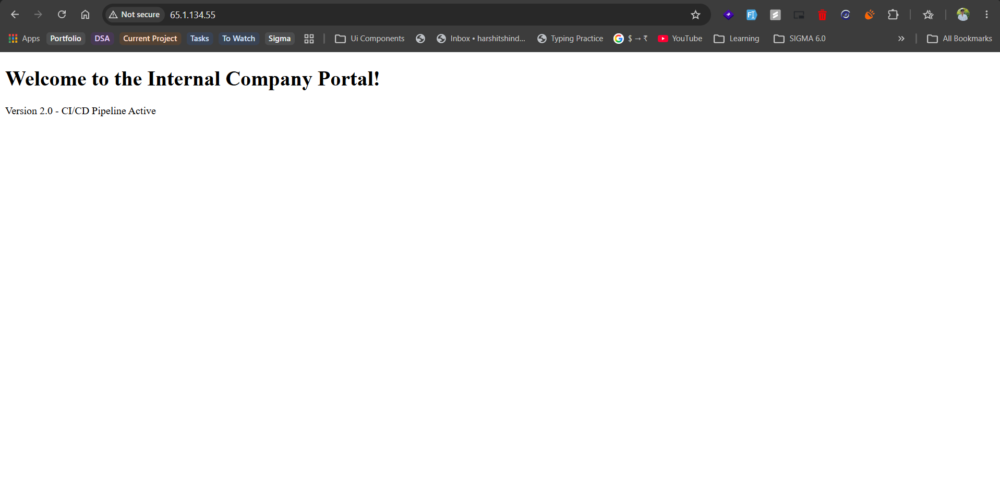
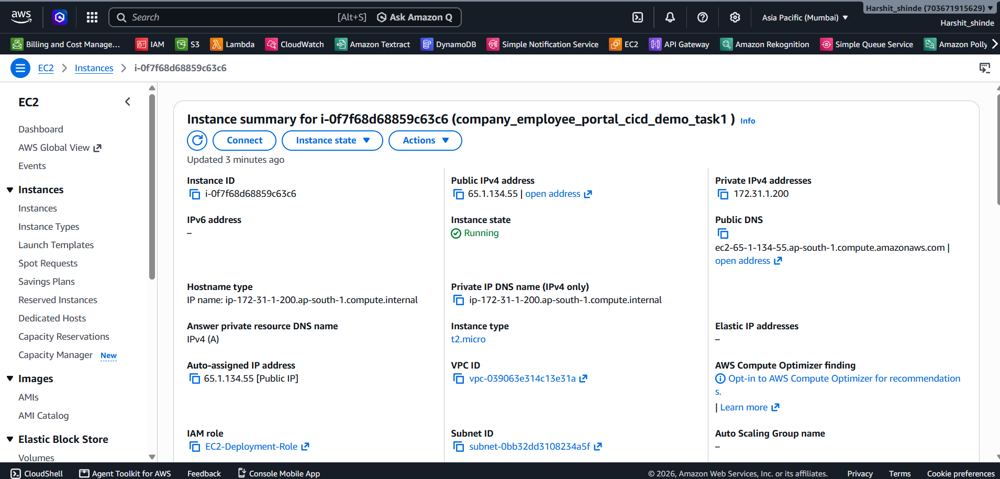

# AWS Company Employee Portal CI/CD Demo

## 📌 Project Overview
This project demonstrates a fully automated Continuous Integration and Continuous Deployment (CI/CD) pipeline on Amazon Web Services (AWS) for an internal company employee portal. The main goal is to establish a seamless, automated workflow where any updates made to the employee portal's web interface are automatically tested, approved, and deployed to live servers without any manual intervention. This minimizes human error, accelerates the release of new features or updates, and ensures the website remains reliable and up-to-date.

## 🏗️ Architecture Design
We have engineered a streamlined deployment process using AWS Developer Tools. The high-level flow of the pipeline is as follows:
1. **Source Control Integration**: A central source repository acts as the single source of truth. Whenever developers push changes to the frontend, the pipeline automatically detects these modifications and triggers the workflow.
2. **Automated Testing and Validation (Continuous Integration)**: A dedicated build environment spins up to run automated quality checks on the code, such as using `htmlhint` to validate HTML structure. This prevents broken or malformed content from reaching the live site.
3. **Packaging for Deployment**: After successful validation, the files and deployment instructions are bundled into a secure, deployable artifact package.
4. **Automated Deployment (Continuous Deployment)**: The deployment process securely delivers the validated package to the target web server. It first prepares the server by cleaning out the old version of the website, installs the newly validated web files, and gracefully reloads the web server software (Nginx) to serve the latest content immediately.

## 🧰 AWS Services Utilized
- **AWS CodeBuild**: Used for continuous integration to run HTML validation tests.
- **AWS CodeDeploy**: Automates the application deployment to the target servers using predefined lifecycle hooks.
- **AWS CodePipeline**: Orchestrates the entire CI/CD workflow, seamlessly integrating source, build, and deployment stages.
- **Amazon EC2**: Serves as the web server hosting the Nginx application.

## 🔐 Security Best Practices Implemented
- **Automated Validation**: Code changes undergo automated linting and validation before deployment, mitigating potential client-side issues.
- **Controlled Deployment Execution**: Deployment scripts (`cleanup.sh`, `reload_nginx.sh`) are executed as root via `appspec.yml` hooks to ensure proper permission management and system state.
- **Clean State Deployments**: The deployment process explicitly removes old files before copying new ones to prevent serving stale or compromised content.

## 📂 Repository Contents
- `README.md`: Project documentation.
- `appspec.yml`: Deployment specification file used by AWS CodeDeploy to define deployment lifecycle hooks and file destinations.
- `buildspec.yml`: Build specification file used by AWS CodeBuild to define the testing commands and build artifacts.
- `cleanup.sh`: Shell script executed before installation to clear existing files in the Nginx directory.
- `index.html`: The main HTML file for the internal company employee portal.
- `reload_nginx.sh`: Shell script executed after installation to gracefully reload the Nginx server.
- `images/`: Directory containing screenshots of the CI/CD pipeline and deployments.

## 🚀 Verification & Testing

